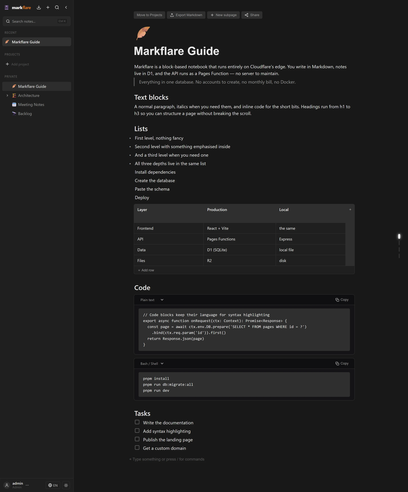
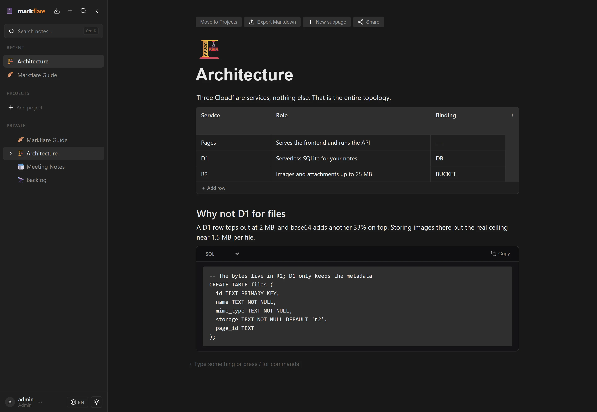
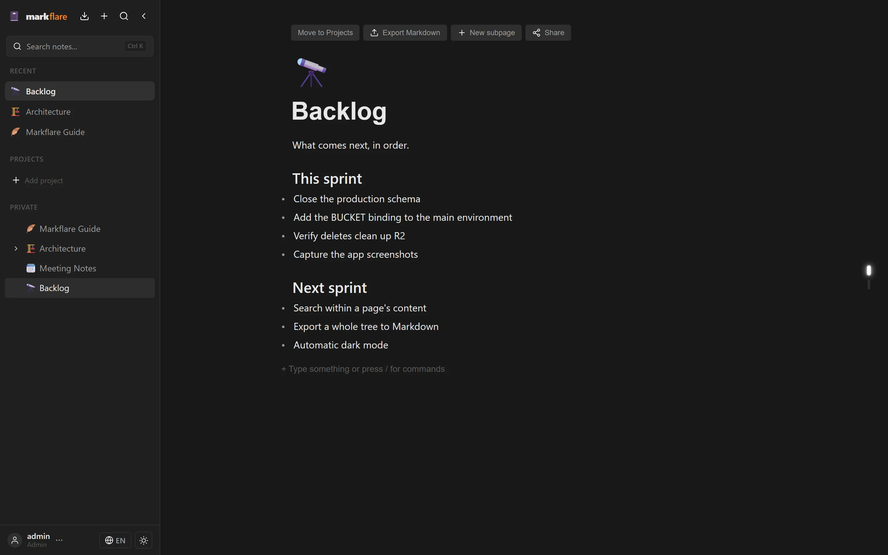
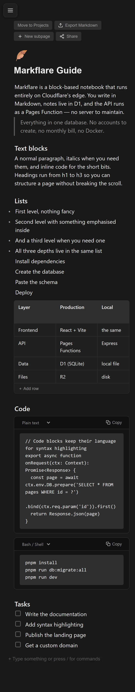

<div align="center">
  
  <h1>Markflare</h1>
</div>

<div align="center">

A self-hosted, block-based note-taking workspace that runs entirely on **Cloudflare**.

</div>

Pages with nested subpages, to-do lists, code blocks, tables, public share links, image
and file uploads, and a bilingual interface (English / Spanish).

## Screenshots

Real captures of the app running — no mockups. The set below was shot in English; the
same pages exist in Spanish under `landing/public/screenshots/es`, and the landing page
swaps between the two based on which one you're reading.

| The block editor | Tables and code |
|---|---|
|  |  |

| Task lists | On a phone |
|---|---|
|  |  |

> They live under `landing/public/` because that is the only directory Astro serves
> to the browser, so the site and this README read the same files. Regenerate them
> with `scripts/seed-demo.cjs es|en` followed by `scripts/shoot-app.cjs`, both in the
> gitignored `scripts/` folder.

---

## What you get

- **Block editor** — type `/` for a command menu: headings, lists, to-dos, code, math,
  tables, quotes, callouts, images, files, subpages.
- **Nested pages** — a page can hold subpages, and deleting a page cascades to them.
- **Drag & drop** — move blocks around, nest them by dropping in the middle, and drop an
  image or document straight into the page to upload it.
- **Public share links** — one click to publish a page (and its subpages) read-only.
- **Markdown in and out** — import a `.md` file, export any page back to Markdown.
- **File storage in R2** — uploads up to 25 MB, never stored in the database.
- **MCP server** — connect AI assistants (Claude Desktop, Cursor, Zed) to your workspace.
- **Bilingual UI** — English and Spanish, switchable at runtime.

## Contents

| # | Section | What it covers |
|---|---------|----------------|
| 1 | [Screenshots](#screenshots) | The app, in English and Spanish |
| 2 | [Stack](#stack) | What it's built with |
| 3 | [The three Cloudflare pieces](#the-three-cloudflare-pieces) | What you're actually creating |
| 4 | [Deploy](#deploy) | Three methods — pick one |
| 5 | [Run locally](#run-locally) | Develop on your machine |
| 6 | [File storage (R2)](#file-storage-r2) | Why uploads aren't in the database |
| 7 | [Database schema](#database-schema) | Every table, as copy-paste SQL |
| 8 | [API](#api) | All HTTP routes |
| 9 | [Configuration](#configuration) | Environment variables |
| 10 | [Model Context Protocol](#model-context-protocol-mcp) | AI assistant integration |
| 11 | [Notes](#notes) | Design decisions worth knowing |

---

## Stack

| Layer | Production | Local dev |
|---|---|---|
| **Frontend** | React 18 + Vite 5 + TypeScript | same |
| **Backend** | Cloudflare Pages Functions (Hono) | Express 5 |
| **Database** | Cloudflare D1 | `better-sqlite3` (SQLite file) |
| **File storage** | Cloudflare R2 | `uploads/` on disk |
| **AI / MCP** | Official Model Context Protocol server (`@modelcontextprotocol/sdk`) | same |

The local server is a functional replica: same routes, same request and response shapes,
so the frontend can't tell the difference.

---

## The three Cloudflare pieces

If this is your first time deploying to Cloudflare, this section is the one that matters.
You create three things, and they each have a job:

| What | Cloudflare service | Job in plain language | Created in |
|---|---|---|---|
| The website | **Pages** | Serves the app and runs the API. It's the "web host". | [step 1.4](#14-create-the-pages-project) |
| Your notes | **D1** | A SQLite database. Holds pages, blocks, and share links. | [step 1.2](#12-create-the-database-and-the-bucket) |
| Your images | **R2** | Object storage, like a private folder of files. | [step 1.2](#12-create-the-database-and-the-bucket) |

Two of them are "bindings": you create them separately, then tell Pages "this variable is
that database". The names are fixed and the code expects them:

| Binding variable | Points to | If it's missing |
|---|---|---|
| `DB` | your D1 database | nothing loads |
| `BUCKET` | your R2 bucket | uploads return `503` |

---

## Deploy

Three methods. All of them end up with the same thing running on
`https://markflare.pages.dev`.

| | **1. Dashboard** ⭐ | **2. Local** | **3. Terminal** |
|---|---|---|---|
| **Who it's for** | most people | people developing the app | people who script everything |
| **Needs a terminal?** | only to run `pnpm install` + build | yes | yes |
| **Who builds the app** | you, or Pages on every push | you | you |
| **Schema applied by** | pasting SQL in a web console | `pnpm run db:migrate:all` | `pnpm run db:migrate:prod` |
| **Bindings set in** | the Pages UI | not needed | local `wrangler.toml` |
| **Redeploys** | drag `dist/` again, or push to Git | — | `pnpm run deploy` |

> **Why there's no `wrangler.toml` in the repo** — on purpose. If that file exists,
> Cloudflare Pages stops letting you manage bindings and secrets from the dashboard UI, and
> you'd have to keep the file in sync. Methods 1 and 2 never need it. Method 3 creates one
> locally; see below.

**Jump to:** [1. Dashboard](#1-cloudflare-dashboard-recommended) ·
[2. Local](#2-local-only-no-deploy) · [3. Terminal](#3-terminal-wrangler-cli)

---

### 1. Cloudflare dashboard (recommended)

> **Time:** about 15 minutes. **Prerequisites:** a Cloudflare account, and `node` + `pnpm`
> on your machine.

#### 1.1. Get the code and build it

Pick whichever fits you:

**Variant A — build it yourself, upload the folder**

```bash
git clone https://github.com/<your-user>/markflare.git
cd markflare
pnpm install
pnpm run build
```

This produces a `dist/` folder. You don't have `git`? Grab the source from
**Code → Download ZIP**, extract it, and run the same `pnpm install && pnpm run build`.

**Variant B — connect to Git and let Pages build every push**

Push the repo to GitHub, then in the next step choose **Connect to Git** instead of
**Upload assets**. Cloudflare rebuilds on every push, so you never run `pnpm run build`
locally again.

```bash
git remote add origin https://github.com/<your-user>/markflare.git
git push -u origin main
```

#### 1.2. Create the database and the bucket

Markflare needs two storage pieces before it can run. Create both now — neither one
existed until a few minutes ago, and both have to exist before the app works.

**The database (D1) — this is where your notes live.**

Your pages, blocks, share links and upload metadata. This is a SQLite database, which is
why a D1 row tops out at 2 MB — relevant in a moment.

**Workers & Pages → D1 SQL databases → Create database**

- Name: `markflare-db`

**The file bucket (R2) — this is where your images and attachments live.**

This one is not optional and not a detail. A D1 row can't hold more than 2 MB, and storing
bytes as base64 inflates them by a further ~33%, so keeping uploads in the database caps
you at a ~1.5 MB image. Putting them in R2 is what lifts that ceiling to **25 MB**, and it
keeps the database for text, which is what a database is good at.

**R2 → Overview → Create bucket**

- Bucket name: `markflare-files`

R2 will ask you to add a card on the free plan the first time — the free tier gives you
10 GB of storage, 1M writes and 10M reads a month, with no charge for bandwidth, which is
far more than a personal workspace uses.

> **Leave the bucket private.** Don't turn on the public `r2.dev` domain. Files are served
> through the app, and a public bucket would expose them directly, bypassing it.
>
> The name doesn't actually matter, as long as you bind it as `BUCKET` in step 1.5.
> `markflare-files` is just the default so these steps are copy-pasteable.

More on why this is split across two services, and what to do if you're upgrading from a
version that kept uploads in the database, in [File storage (R2)](#file-storage-r2).

#### 1.3. Create the tables

Open `markflare-db` → **Console** tab. Paste each of the five blocks below and hit
**Execute**, in order.

Every block uses `IF NOT EXISTS` throughout, so re-running any of them is safe. The full
SQL also lives in [`migrations/`](migrations) if you'd rather apply it from a terminal —
see [Database schema](#database-schema).

<details>
<summary><strong>Block 1</strong> — <code>0001_initial.sql</code>: pages and blocks</summary>

```sql
CREATE TABLE IF NOT EXISTS pages (
  id TEXT PRIMARY KEY,
  title TEXT NOT NULL DEFAULT 'Untitled',
  icon TEXT NOT NULL DEFAULT '📄',
  parent_id TEXT,
  position INTEGER NOT NULL DEFAULT 0,
  created_at TEXT NOT NULL DEFAULT (datetime('now')),
  updated_at TEXT NOT NULL DEFAULT (datetime('now')),
  FOREIGN KEY (parent_id) REFERENCES pages(id) ON DELETE CASCADE
);

CREATE TABLE IF NOT EXISTS blocks (
  id TEXT PRIMARY KEY,
  page_id TEXT NOT NULL,
  type TEXT NOT NULL DEFAULT 'paragraph',
  content TEXT NOT NULL DEFAULT '',
  checked INTEGER NOT NULL DEFAULT 0,
  language TEXT NOT NULL DEFAULT '',
  position INTEGER NOT NULL DEFAULT 0,
  created_at TEXT NOT NULL DEFAULT (datetime('now')),
  updated_at TEXT NOT NULL DEFAULT (datetime('now')),
  parent_id TEXT,
  collapsed INTEGER NOT NULL DEFAULT 0,
  FOREIGN KEY (page_id) REFERENCES pages(id) ON DELETE CASCADE
);

CREATE INDEX IF NOT EXISTS idx_pages_parent ON pages(parent_id);
CREATE INDEX IF NOT EXISTS idx_blocks_page ON blocks(page_id);
CREATE INDEX IF NOT EXISTS idx_blocks_position ON blocks(page_id, position);
```

</details>

<details>
<summary><strong>Block 2</strong> — <code>0002_files.sql</code>: uploaded file metadata</summary>

```sql
CREATE TABLE IF NOT EXISTS files (
  id TEXT PRIMARY KEY,
  name TEXT NOT NULL,
  mime_type TEXT NOT NULL,
  size INTEGER NOT NULL DEFAULT 0,
  storage TEXT NOT NULL DEFAULT 'r2',
  page_id TEXT,
  created_at TEXT NOT NULL DEFAULT (datetime('now')),
  FOREIGN KEY (page_id) REFERENCES pages(id) ON DELETE SET NULL
);

CREATE INDEX IF NOT EXISTS idx_files_page ON files(page_id);
```

</details>

<details>
<summary><strong>Block 3</strong> — <code>0003_workspace.sql</code>: sidebar name and icon</summary>

```sql
CREATE TABLE IF NOT EXISTS workspace (
  id INTEGER PRIMARY KEY CHECK (id = 1),
  name TEXT NOT NULL DEFAULT 'My Workspace',
  icon TEXT NOT NULL DEFAULT '📋',
  updated_at TEXT NOT NULL DEFAULT (datetime('now'))
);

INSERT OR IGNORE INTO workspace (id, name, icon) VALUES (1, 'My Workspace', '📋');
```

</details>

<details>
<summary><strong>Block 4</strong> — <code>0004_shares.sql</code>: public share tokens</summary>

```sql
CREATE TABLE IF NOT EXISTS page_shares (
  page_id TEXT PRIMARY KEY,
  token TEXT NOT NULL UNIQUE,
  revoked INTEGER NOT NULL DEFAULT 0,
  created_at TEXT NOT NULL DEFAULT (datetime('now')),
  FOREIGN KEY (page_id) REFERENCES pages(id) ON DELETE CASCADE
);

CREATE INDEX IF NOT EXISTS idx_page_shares_token ON page_shares(token);
```

</details>

<details>
<summary><strong>Block 5</strong> — <code>0005_api_tokens.sql</code>: tokens for the MCP server</summary>

```sql
CREATE TABLE IF NOT EXISTS api_tokens (
  id TEXT PRIMARY KEY,
  name TEXT NOT NULL DEFAULT 'MCP Token',
  token TEXT NOT NULL UNIQUE,
  created_at TEXT NOT NULL DEFAULT (datetime('now')),
  expires_at INTEGER NOT NULL
);

CREATE INDEX IF NOT EXISTS idx_api_tokens_id ON api_tokens(id);
```

</details>

#### 1.4. Create the Pages project

**Workers & Pages → Create application → Pages**

- **Upload assets** (Variant A): project name `markflare`, production branch `main`, then
  drag your `dist/` folder onto the upload area.
- **Connect to Git** (Variant B): pick your GitHub account and the `markflare` repo,
  project name `markflare`, production branch `main`.

If you chose **Connect to Git**, set these on the build configuration screen — they are
not filled in for you:

- **Build command**: `pnpm run build` ← must be set. Leaving it blank makes Pages skip the
  build entirely, which fails because `functions/` needs its dependencies installed.
- **Build output directory**: `dist`
- **Root directory**: leave blank

Cloudflare detects `functions/api/[[route]].ts` automatically and deploys it as your API.

#### 1.5. Wire up the bindings and secrets

In **Settings → Functions**:

- **Compatibility date** → `2024-09-01`
- **D1 database bindings → Add**:
  - Variable name: `DB`
  - D1 database: `markflare-db`
- **R2 bucket bindings → Add**:
  - Variable name: `BUCKET`
  - R2 bucket: `markflare-files`

In **Settings → Variables and secrets → Add** (use the **Encrypt** type, not Plaintext):

| Variable | Value |
|---|---|
| `AUTH_USERNAME` | the username you'll log in with |
| `AUTH_PASSWORD` | its password — use a strong one |
| `AUTH_SECRET` | a long random string; rotating it invalidates every session |

Generate `AUTH_SECRET` with:

```bash
openssl rand -hex 32
```

> **Important:** Pages injects bindings and secrets into the Worker on the **next deploy**.
> If login fails with `503` right after adding them, trigger a redeploy — push an empty
> commit, or click **Retry deployment** on the latest build.

#### 1.6. Done

Your site is live at `https://markflare.pages.dev`. Sign in with the `AUTH_USERNAME` and
`AUTH_PASSWORD` you just set.

**Custom domain (optional):** **Custom domains → Set up a custom domain** and follow the
prompts. Cloudflare issues the certificate automatically.

---

### 2. Local only (no deploy)

Use this to work on Markflare without putting anything on the internet. There is no Cloudflare
project, no D1, and no R2 — the local server uses a SQLite file and a folder on disk.

```bash
git clone https://github.com/<your-user>/markflare.git
cd markflare
pnpm install
cp .env.example .dev.vars      # set AUTH_USERNAME, AUTH_PASSWORD, AUTH_SECRET
pnpm run db:migrate:all        # creates data/markflare.db with the schema
pnpm run dev                   # Express on :3000 + Vite on :5173
```

Open <http://localhost:5173> and sign in with the credentials in `.dev.vars`.

More detail, including the hot-reload caveat, in [Run locally](#run-locally).

---

### 3. Terminal (`wrangler` CLI)

This method scripts the whole deployment. Because you manage bindings through a config
file instead of the dashboard, it needs a local `wrangler.toml` — which is why the repo
doesn't ship one.

#### 3.1. Build

```bash
git clone https://github.com/<your-user>/markflare.git
cd markflare
pnpm install
pnpm run build
```

#### 3.2. Create the database and the bucket

Same two storage pieces as [step 1.2](#12-create-the-database-and-the-bucket) — and both
still get created from the dashboard, since neither can be created from the CLI.

**The database (D1)** — **Workers & Pages → D1 SQL databases → Create database**, named
`markflare-db`. Open it and copy the **Database ID** (a UUID) — you need it in step 3.3.

**The file bucket (R2)** — **R2 → Overview → Create bucket**, named `markflare-files`.
Leave it private; there's no reason to expose it here either.

#### 3.3. Create a local `wrangler.toml`

In the project root:

```toml
name = "markflare"
compatibility_date = "2024-09-01"
pages_build_output_dir = "dist"

[[d1_databases]]
binding = "DB"
database_name = "markflare-db"
database_id = "PASTE-YOUR-D1-UUID-HERE"   # ← the UUID from step 3.2

[[r2_buckets]]
binding = "BUCKET"
bucket_name = "markflare-files"
```

**Don't commit this file** — it contains your project-specific D1 UUID. It's already in
`.gitignore`.

#### 3.4. Apply the schema

```bash
pnpm run db:migrate:prod
```

That runs `wrangler d1 migrations apply markflare-db --remote`, which reads every file in
`migrations/` in order and applies them in a single batch.

#### 3.5. Deploy

```bash
pnpm run deploy
```

Which is `pnpm run build && wrangler pages deploy dist`. The Pages project is created on
the first deploy if it doesn't exist yet.

#### 3.6. Set the secrets

The deploy works but login won't, until you add the three `AUTH_*` values. These stay in
the dashboard even in this method — **Settings → Variables and secrets → Add** (**Encrypt**
type): `AUTH_USERNAME`, `AUTH_PASSWORD`, `AUTH_SECRET`.

**Custom domain (optional):** **Custom domains → Set up a custom domain**.

---

## Run locally

The local stack mirrors production closely enough that you rarely need Cloudflare to work
on Markflare.

| Piece | Production | Local |
|---|---|---|
| Database | D1 | SQLite at `data/markflare.db` |
| Uploads | R2 bucket | `uploads/` on disk |
| API | Pages Function | Express on `:3000` |

```bash
pnpm run dev          # both servers, with hot reload
pnpm run dev:server   # API only
pnpm run dev:web      # frontend only
```

| Script | What it does |
|---|---|
| `pnpm run dev` | Express + Vite together |
| `pnpm run build` | type-check and build to `dist/` |
| `pnpm run db:migrate:all` | apply migrations to the local SQLite file |
| `pnpm run db:migrate:prod` | apply migrations to the remote D1 |
| `pnpm run mcp` | start the MCP server |
| `pnpm run test:mcp` | run the MCP test suite |

> **Upgrading from an older checkout?** Migration files are edited in place and tracked by
> name in `_migrations_applied`, so a database that was already migrated will **not** pick
> up schema changes. Delete `data/` and re-run `pnpm run db:migrate:all` to rebuild it.

---

## File storage (R2)

> Creating the bucket and binding it are covered in
> [step 1.2](#12-create-the-database-and-the-bucket). This section is the reasoning behind
> that split, and what to do if you're coming from an older version.

Images and attachments never go into the database. In production they land in an R2 bucket;
in local dev they land in `uploads/`. The `files` table keeps metadata only, plus a `storage`
column recording which backend owns the bytes. Uploads are capped at **25 MB**.

**Why not just use the database?** A D1 row tops out at 2 MB, and base64 inflates bytes by
a further ~33%, so the ceiling would be roughly a 1.5 MB image — and every note would
compete with those bytes for the same 500 MB on the free plan. Splitting them keeps D1 for
text, which is what it's good at, and lets the file bucket scale on its own.

**What it costs.** The free tier gives 10 GB-month of storage, 1M writes and 10M reads per
month, and bandwidth is never charged. Past that it's $0.015/GB-month, so a personal
workspace doesn't realistically leave $0.

**One rule worth knowing:** the bucket must stay private, and uploads go through
`/api/files/:id`. That route is intentionally unauthenticated so images inside public share
pages can load, which means the R2 bucket is the only thing standing between your uploads
and the open internet. Don't turn on `r2.dev`.

### Already deployed with an older version?

The old schema stored the file bytes in a `data TEXT` column, base64-encoded. Migration
files are edited in place, so the new shape only lands on a **fresh** database. If you
already have one, run this once in the D1 Console:

```sql
DROP TABLE IF EXISTS files;

CREATE TABLE files (
  id TEXT PRIMARY KEY,
  name TEXT NOT NULL,
  mime_type TEXT NOT NULL,
  size INTEGER NOT NULL DEFAULT 0,
  storage TEXT NOT NULL DEFAULT 'r2',
  page_id TEXT,
  created_at TEXT NOT NULL DEFAULT (datetime('now')),
  FOREIGN KEY (page_id) REFERENCES pages(id) ON DELETE SET NULL
);

CREATE INDEX IF NOT EXISTS idx_files_page ON files(page_id);
```

Images already embedded in your pages will 404 afterwards — their bytes went out with the
old table. Re-upload them.

---

## Database schema

All migrations live in `migrations/NNNN_*.sql`, run in filename order, each wrapped in a
transaction. They are idempotent, so re-running is safe.

| File | Adds |
|---|---|
| `0001_initial.sql` | `pages`, `blocks` (with `parent_id` + `collapsed`), indexes |
| `0002_files.sql` | `files` — metadata only; the bytes live in R2 |
| `0003_workspace.sql` | `workspace` singleton (sidebar name + icon) |
| `0004_shares.sql` | `page_shares` — public share tokens with a `revoked` tombstone |
| `0005_api_tokens.sql` | `api_tokens` — tokens for the MCP server and CLI integrations |

To apply them to a remote D1 from a terminal:

```bash
pnpm run db:migrate:prod     # wrangler d1 migrations apply markflare-db --remote
```

To apply them by hand in the dashboard, use the five blocks in
[step 1.3](#13-create-the-tables).

> **D1 caveat** — SQLite has no `ADD COLUMN IF NOT EXISTS`, and D1 has no `DROP COLUMN`.
> Any future migration that changes a table's shape has to use the rebuild pattern: create
> `_<table>_new` with the new shape, `INSERT INTO _<table>_new SELECT ... FROM <table>`,
> `DROP TABLE <table>`, then `ALTER TABLE _<table>_new RENAME TO <table>` — the whole script
> in one transaction.

---

## API

Everything is mounted under `/api`. 🔒 routes need a bearer token from
`POST /api/auth/login`, stored in `localStorage` and sent as `Authorization: Bearer …`.

| Method | Path | Auth | Purpose |
|---|---|---|---|
| POST | `/api/auth/login` | — | Get a 24h bearer token |
| GET | `/api/pages` | 🔒 | List all pages |
| POST | `/api/pages` | 🔒 | Create a page |
| POST | `/api/pages/import` | 🔒 | Create a page from markdown |
| GET | `/api/pages/:id` | 🔒 | Page + ordered blocks |
| GET | `/api/pages/:id/export` | 🔒 | Export page as markdown |
| PUT | `/api/pages/:id` | 🔒 | Update page |
| DELETE | `/api/pages/:id` | 🔒 | Cascade delete page, descendants, blocks and their files |
| GET | `/api/pages/:id/cascade-count` | 🔒 | How many pages/blocks a delete would remove |
| POST | `/api/pages/:id/blocks` | 🔒 | Create a block |
| PUT | `/api/blocks/:id` | 🔒 | Update a block (reparenting is cycle-safe) |
| DELETE | `/api/blocks/:id` | 🔒 | Delete a block, and its upload if nothing else references it |
| PUT | `/api/blocks/reorder` | 🔒 | Batch reorder blocks |
| POST | `/api/files/upload` | 🔒 | Upload a file (≤ 25 MB, multipart) |
| GET | `/api/files/:id` | — | Stream a file — public so share pages can render images |
| GET | `/api/workspace` | 🔒 | Get sidebar name + icon |
| PUT | `/api/workspace` | 🔒 | Update workspace |
| POST | `/api/pages/:id/share` | 🔒 | Activate a public share |
| GET | `/api/pages/:id/share` | 🔒 | Get the active share |
| DELETE | `/api/pages/:id/share` | 🔒 | Revoke a share |
| GET | `/api/share/:token` | — | Public tree for a share |
| GET | `/api/share/:token/page/:pageId` | — | Public page inside a share |
| GET | `/api/auth/tokens` | 🔒 | List your API/MCP tokens |
| POST | `/api/auth/token` | 🔒 | Create an API/MCP token |
| DELETE | `/api/auth/tokens/:id` | 🔒 | Revoke a token |
| GET | `/api/search` | 🔒 | Search pages and blocks |

`GET /api/files/:id` is unauthenticated on purpose: a shared page is viewable by anyone
with the link, and its embedded images have to load the same way. The R2 bucket stays
private — the Worker is what serves the bytes.

---

## Configuration

A template lives at `.env.example`. Copy it to `.dev.vars` and fill in real values;
`.dev.vars` is gitignored.

```bash
cp .env.example .dev.vars
```

| Variable | Required | Description |
|---|---|---|
| `AUTH_USERNAME` | yes | The single allowed username |
| `AUTH_PASSWORD` | yes | The single allowed password — use a strong one |
| `AUTH_SECRET` | yes | Long random string for signing bearer tokens. Generate with `openssl rand -hex 32`. Rotating it **invalidates every token issued so far**, which is what you want if one ever leaks. |
| `markflare_DB_PATH` | no | Override the local SQLite path (default `./data/markflare.db`) |

**Local** — read from `.dev.vars` by both `wrangler pages dev` and the local Express server.

**Production** — set the same three `AUTH_*` values as **Encrypt**-type secrets in the
Cloudflare dashboard, under **Settings → Variables and secrets**.

---

## Model Context Protocol (MCP)

Markflare ships an MCP server, so AI assistants can read and write your workspace.
Requires the `api_tokens` table ([block 5](#13-create-the-tables)).

Generate a token from **Account & Settings → API / MCP Token** in the app, then:

```bash
pnpm run mcp        # start the MCP server on stdio
pnpm run test:mcp   # run the end-to-end test suite
```

It can import Markdown content and `.md` files into pages, list your pages and inspect the
hierarchy, and search pages and blocks.

Client configuration for Claude Desktop, Cursor and Zed is in
[`mcp/README.md`](mcp/README.md).

---

## Notes

- **Auth** — single user. 24h HMAC-SHA256 bearer tokens, constant-time comparisons, login
  rate-limited to 5 attempts per minute per IP.
- **CORS** — same-origin only; the frontend and `/api` share a host.
- **Foreign keys** — `PRAGMA foreign_keys = ON` runs on every D1 request, because D1
  connections start with FKs off.
- **Public shares** — 128-bit tokens, regenerated on every re-activation. Visitor requests
  are scoped to the share's descendant tree, so a share can't be walked upwards.
- **Deleting pages** — cascading a page also removes its blocks, the files they referenced,
  and the R2 objects. An upload is only removed once no block points at it any more, so
  duplicated images don't break when you delete one copy.

---

## Tech choices

- **pnpm** — the package manager throughout (lockfile is `pnpm-lock.yaml`), for strict
  dependency resolution with no phantom deps, a content-addressable store that saves disk
  across projects, and faster installs. `pnpm.onlyBuiltDependencies` in `package.json`
  whitelists the few packages that need build scripts (`better-sqlite3`, `esbuild`,
  `sharp`, `workerd`). Because Pages runs `npm install` by default on a pnpm project,
  `package.json` declares `"packageManager": "pnpm@10.11.1"` so Corepack picks pnpm up
  automatically. Every command in this README is `pnpm …` — never `npm …`.
- **No `wrangler.toml` in the repo** — see [Deploy](#deploy).

---

## License

MIT.
